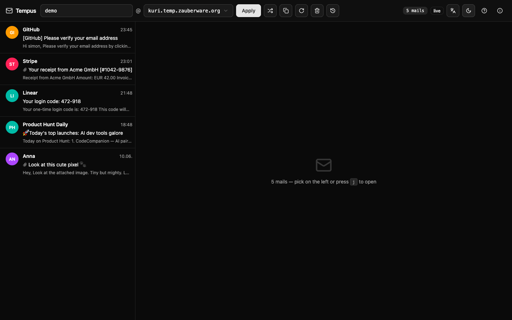
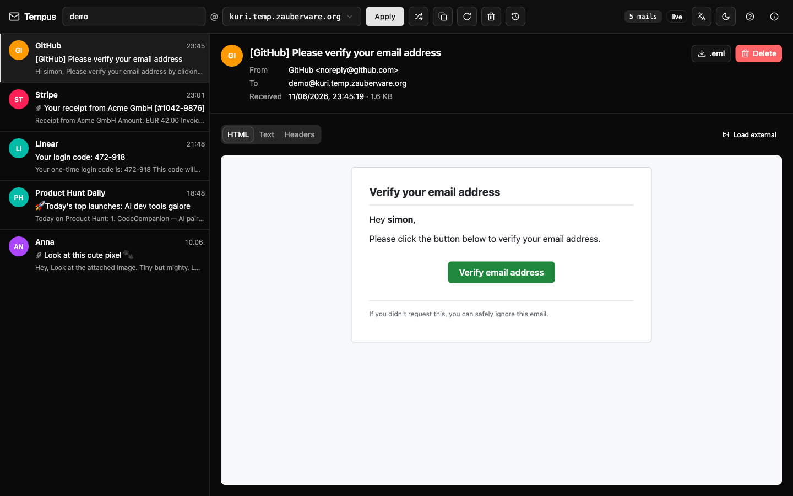
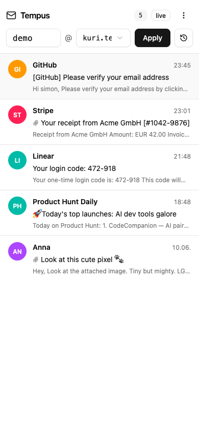
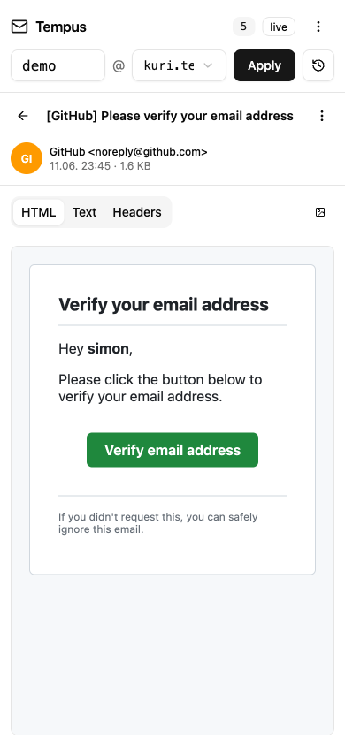

# Tempus — disposable email service

Self-hosted disposable email service on Cloudflare. Web UI in the spirit of
temp-mail.org, REST API for tests and AI agents, multi-domain pool. Runs on
the Cloudflare free tier — no recurring service cost beyond what you already
pay for a domain.



## What's in the box

- **Inbound Worker** (`src/inbound.ts`) — triggered by Cloudflare Email Routing
  on every incoming mail. Parses the message with [`postal-mime`][postal-mime]
  and writes both the parsed fields and the raw `.eml` (as a BLOB) into D1.
  Rejects domains that aren't in the configured pool.
- **Web Worker** (`src/web.ts`) — Hono app with a JSON REST API. Non-API
  requests fall through to the static SPA via Cloudflare's `[assets]` binding.
  Basic Auth protects **everything** (HTML, JS, API). A scheduled handler runs
  hourly and deletes messages older than 7 days and inboxes idle for 30+ days.
- **Web UI** (`web/`) — Vite + React 19 + Tailwind v4 + shadcn/ui + TanStack
  Query. Built to `web/dist/` and served by the web worker.
- **D1** — one database, two tables: `inboxes` and `messages`. Raw `.eml` lives
  in a BLOB column (capped at ~950 KB per row).

[postal-mime]: https://github.com/postalsys/postal-mime

## UI features

- Empty-state hero on first load: the address front-and-center with a
  single-click copy. The first useful action a user actually wants to take.
- Inbox history in localStorage (last 10) reachable from a popover in the
  header — addresses outlive the current tab session.
- Sender avatars (hash-color initials).
- Live HTML rendering: `cid:` inline images resolve through the API, external
  resources are stripped by default with a per-message toggle to load them.
- Light / dark / system theme toggle with no flash on load.
- Resizable sidebar (drag the divider; width persists per browser).
- Keyboard shortcuts: `j` / `k` navigate, `r` refresh, `c` copy address, `n`
  new random inbox, `Shift+E` empty inbox, `?` shortcut help.
- Onboarding modal on first visit, reopenable via the ⓘ icon in the topbar.
- Skeleton loaders, manual refresh, "empty inbox" bulk delete.

### Message detail

`postal-mime` parses inbound mail into HTML + text + headers + attachments;
the UI renders them in three tabs with external resources stripped by default.



### Mobile

Master/detail layout collapses to a single pane on small screens — tap a row
to open the detail, tap back to return.

<p>
  
  
</p>

## REST API

All endpoints require Basic Auth.

| Method | Path | Purpose |
|---|---|---|
| `GET` | `/api/pool` | List of configured pool domains |
| `POST` | `/api/inboxes` | Create/touch an inbox (body: `{local?, domain?}`) |
| `GET` | `/api/inboxes/:address/messages` | List messages |
| `GET` | `/api/inboxes/:address/messages/:id` | Parsed message detail |
| `GET` | `/api/inboxes/:address/messages/:id/raw` | Raw `.eml` |
| `GET` | `/api/inboxes/:address/messages/:id/attachments/:filename` | Attachment download |
| `GET` | `/api/inboxes/:address/messages/:id/cid/:cid` | Inline image by Content-ID |
| `DELETE` | `/api/inboxes/:address/messages/:id` | Delete one message |
| `DELETE` | `/api/inboxes/:address/messages` | Empty inbox |

Example — an agent waiting for a verification mail:

```bash
INBOX=$(curl -su $USER:$PASS https://tempus.example.com/api/inboxes \
  -H 'content-type: application/json' \
  -d '{"local":"signup-test-1","domain":"nosu.tmp.example.com"}' | jq -r .address)

# trigger the signup using $INBOX as the address …

while :; do
  N=$(curl -su $USER:$PASS \
    "https://tempus.example.com/api/inboxes/$INBOX/messages" \
    | jq '.messages | length')
  [ "$N" -gt 0 ] && break
  sleep 3
done
```

## Prerequisites

- Cloudflare account with a zone you don't use for production mail (the zone's
  apex MX records get pointed at Cloudflare Email Routing — see notes below).
- Node.js ≥ 20 and npm.
- For the auto-deploy on push: a GitHub repo and one Cloudflare API token
  stored as a repo secret.

## First-time setup

```bash
npm install            # worker deps (Hono, postal-mime, ulid)
npm run ui:install     # web UI deps (React, Vite, Tailwind, shadcn)
npx wrangler login
```

### 1. Create D1

```bash
npx wrangler d1 create tempmail
```

Paste the returned `database_id` into **both** `wrangler.toml` and
`wrangler.inbound.toml`. Apply migrations:

```bash
npx wrangler d1 migrations apply tempmail --remote
```

### 2. Configure pool domains

In both `wrangler.toml` and `wrangler.inbound.toml`:

```toml
POOL_DOMAINS = "nosu.tmp.example.com,kuno.tmp.example.com,…"
```

Anything not in this list is rejected by the inbound worker.

### 3. Basic-Auth credentials

Set on both workers (the UI auth lives on the web worker, but having the same
on the inbound worker keeps the deploy step consistent):

```bash
npx wrangler secret put BASIC_AUTH_USER
npx wrangler secret put BASIC_AUTH_PASS
npx wrangler secret put BASIC_AUTH_USER --config wrangler.inbound.toml
npx wrangler secret put BASIC_AUTH_PASS --config wrangler.inbound.toml
```

### 4. Deploy

```bash
npm run deploy
```

This builds the UI, deploys the web worker (custom domain wired from the
`[[routes]]` block in `wrangler.toml`), and deploys the inbound worker.

### 5. Set up Cloudflare Email Routing

This is the part that catches people. Done once per zone, in the Cloudflare
dashboard:

1. Zone → **Email** → **Email Routing** → **Enable**. Confirm the MX/SPF/DKIM
   records on the zone apex (this overrides whatever mail provider was there
   before).
2. **Routing rules** → **Catch-all** → **Send to a Worker** → `tempmail-inbound`.
3. For each pool subdomain (`nosu.tmp.example.com`, …) add an MX record
   pointing at `route1.mx.cloudflare.net` (priority 72), `route2…` (15) and
   `route3…` (42). All three are needed.

The inbound worker filters by `POOL_DOMAINS`, so anything else delivered to the
zone catch-all gets a 550 bounce instead of polluting the inbox.

Alternatively, all of the above can be scripted via the CF API once you have a
token with **Zone → Email Routing → Edit** and **DNS → Edit** permissions.

### 6. (Optional) Workers.dev subdomain

If this account has never used Workers before, open
**Workers & Pages** in the dashboard once. Cloudflare requires an account-wide
`*.workers.dev` subdomain to exist before it lets you attach cron triggers.

## Continuous deployment (GitHub Actions)

`.github/workflows/deploy.yml` is included. To use it:

1. Create a Cloudflare API token with these permissions:
   - Account → **Workers Scripts**: Edit
   - Account → **D1**: Edit
   - Account → **Workers Subdomain**: Read
   - Zone → **Workers Routes**: Edit
   - Zone → **DNS**: Edit
   - User → **User Details**: Read
2. Add it to the GitHub repo as a secret named `CLOUDFLARE_API_TOKEN`.
3. Also add `CLOUDFLARE_ACCOUNT_ID`.

Every push to `main` then runs `tsc --noEmit`, builds the UI, applies pending
D1 migrations, and deploys both workers.

## Local development

```bash
cp .dev.vars.example .dev.vars      # then edit BASIC_AUTH_USER / BASIC_AUTH_PASS
npm run db:migrate:local
```

Two modes:

- **Static UI** (closest to production):
  ```bash
  npm run dev      # builds UI once, then wrangler dev on :8787
  ```

- **Hot-reload UI** (Vite dev server proxying `/api/*` to the worker):
  ```bash
  # terminal 1
  npx wrangler dev
  # terminal 2
  npm run ui:dev   # vite on :5173 with API proxy
  ```

### Seed test mails

```bash
npm run seed -- demo@nosu.tmp.example.com
```

Inserts five canned messages (HTML, plain text, an attachment, a remote-image
newsletter) into the local D1 so you can click around without sending real
mail. The seed populates the same parsed columns the inbound worker writes,
so the UI behaves identically to production.

`POOL_DOMAINS` can be overridden locally via `.dev.vars` — useful if you want
the seeded inbox to show up in the address dropdown without touching the
production list.

## Architecture notes

- **Why D1-BLOB and not R2 for raw `.eml`?** R2 requires a payment method on
  the Cloudflare account before it can be enabled, even on the free tier. D1's
  ~1 MB row limit covers the overwhelming majority of real mail and we cap at
  950 KB to leave room for metadata. R2 is a simple swap if you ever need it.

- **Why a zone catch-all instead of per-subdomain Email Routing?** Cloudflare
  doesn't expose per-subdomain routing via API tokens, only via the dashboard
  UI. Putting one zone-wide catch-all on the inbound worker and letting the
  worker filter by `POOL_DOMAINS` is one API call instead of N manual ones,
  and the worker's reject path generates the same 550 bounce a missing
  subdomain would.

- **Why no R2-style pre-signed URLs for attachments?** The attachments are
  small enough to stream through the worker, Basic Auth protects them
  consistently, and there's no public-attachment use case we wanted to support.

## License

MIT.
